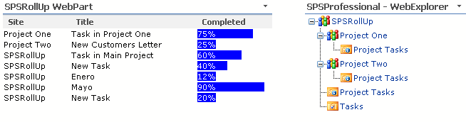
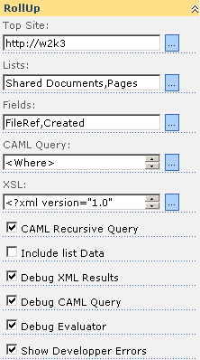
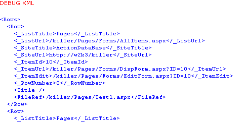
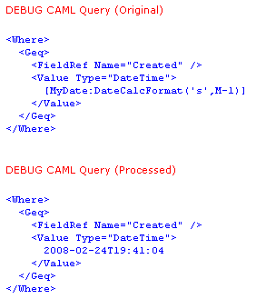
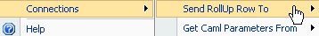
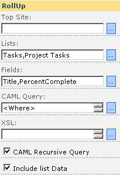
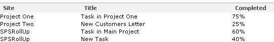
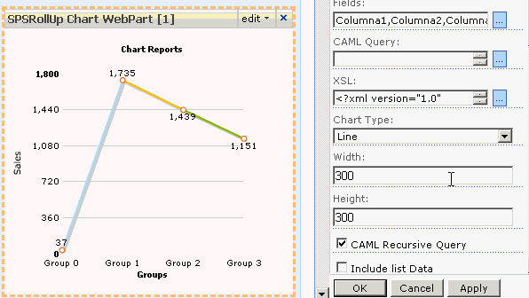

# SPSProfessional.SharePoint.WebParts.RollUp

SPSRollUp WebPart (May 2008)

With the **SPSProfessional** RollUp WebPart you can aggregate contents from different lists and sites.

video

[](https://www.youtube.com/watch?v=jpF60v-thls)

The **SPSRollUp** webpart is based in the well known **csegRollUp** of [Carlos Segura](http://www.ideseg.com/CategoryView,category,csegRollUp.aspx) that is undoubtedly one of the most used webparts for SharePoint 2003.

With SPSRollUp you can aggregate incoming content from various lists. To do this you only have to specify the site from which you want to crawl data, your wish lists and the fields’ names.  



The **SPSProfessional** RollUp, crawls every site and adds the lists and fields’ contents.

### Installation

See: **[Install SPSProfessional Solutions](/page/install-spsprofessional-sharepoint-solutions.aspx)**

### Installation Requirements

*   The **SPSProfessional** RollUp WebPart performs in **WSS 3** and or **MOSS 2007**
*   **SharePoint** Administrator’s Account is needed to install the solution

WebPart Properties
------------------



In the webpart properties you can configure:

**Top Site:** Site where the aggregation begins, if the Top Site property is empty the RollUp will begin at the current web level

**Lists:** List names, you can specify more than one list, separating the lists names with a comma.

**Fields:** Field names that you want to add, separating each field’s name with a comma.

**CAML query:** You can specify here a CAML query where the rollup will be used to obtain data from each list. If there is no query it will mean that all lists’ data have been used.

**XSLT:** The XML Style sheet is used to transform the XML into HTML. It is Included in the package. There are three XSL Samples.

*   Generic Table sample
*   Generic Table with Paging sample
*   Generic Table with Paging and Sorting

[**See Sample Templates included in the solution package**](/page/SPSRollUp-Sample-Templates.aspx)

**Recursive CAML:** If the CAML recursive query is checked the query will be in recursive form.

**Included List Data:** If it is checked, the rollup will add some extra fields to the results

*   <\_ListTitle/> List title
*   <\_ListUrl/> Url the default view
*   <\_SiteTitle/> Site title
*   <\_SiteUrl/> Site Url
*   <\_ItemID/> Item ID
*   <\_ItemUrl/> Item Url
*   <\_ItemEdit/> Edit Item Page
*   <\_RowNumber/> Row number in the set

**Debug XML Results:** If the SPSRollUp is checked it will show the XML crawled results so you can use this to test the XSL.



**Debug CAML Query:** If it is checked the SPSRollUp will show the original CAML query and the processed one that is the one in which the functions are substituted with your values.



**Show Sample Functions:** If it is checked the SPSRollUp will show an example table with a set of custom functions that you can use in the CAML queries and in the current values. (see:  **[Functions](/page/SPSRollUp-CAML-Functions.aspx)**)

Inside the CAML Queries you can use a set of custom functions made by **SPSProfessional**; these functions have the next format:

```[<Variable Name>:<Function(<arguments>)> or <Default value>]```

Variable name, it is the name of a variable for example “MyDate”, in this function you can use one of the **SPSProfessional** custom functions as _DateFormat(’s’)_ that returns the current date time in a shorter format.

Then the correct syntax which you can use inside the query and it will be _\[Date:DateFormat(‘s’)\]_

```xml
<Where\> <Eq\> <FieldRef Name\="StartDate" /> <Value Type\="Text"\>\[Date:DateFormat('s')\]</Value\> </Eq\> </Where\> 
<Where\> 
````

This CAML query must return the items that match the condition where StartDate is equal to current date time.

For a complete list of functions see: [**Functions**](/page/SPSRollUp-CAML-Functions.aspx)

Also this is a form to introduce a variable in the query. The variable has the function value as a default.

We can connect the rollup with other webparts in order to receive a value for this variable. If the value is provided by other webparts, the new value will be the value used.



Also we have provided the XSLT with a special namespace, this namespace counts with some special functions that we will expand in successive versions. Here they are the ones we already have:

`sps:Event(action, parameters) and sps:EventJS(action, parameters)`

You can use ‘Select’ as an action, to send a Row of data to a consumer’s webpart, the parameter must contain the record number to be able to be sent to the consumer webpart. Each row crawled by the SPSRollUp has a \_RowNumber element, as an unique identifier inside the results.

Other action is Page, that will be used by the sample templates to change pages, and Order them and also will be used by the sample templates to sort the results.

You can use this snippet to select and provide a record

```html
<a href\="{sps:Event('Select',\_RowNumber)}"\>  </a\>
```

Then when the XML data is transformed into HTML with the XSLT, the custom’s function sps:Event is replaced by a JavaScript function that will be responsible for sending the record’s data via the provider’s interface.

For more functions on the sps namespace see [**SPS Namespace functions**](/page/SPS-Namespace-Functions.aspx)

SPSRollUp can act as a consumer, receiving data to be used in CAML Queries and to be used to send a complete row of data from a provider to other webparts.  

Included in the package there are three XSLT samples showing how you can do this.

Creating a Simple Report
------------------------

This is an introductory guide to **SPSRollUp** to create a simple report



We want to get the status of all pending tasks from all subsites. (Sites that are below the current one).

The list-type tasks, from which we obtain data are called "Tasks" and "Project Tasks", and the fields that we want to show are: The site where the task is in, the task’s name and the completion percentage.

To which we must fill the **SPSRollUp** properties as follows:

**Top Site**, leave blank to begin tracking from the level at which we find ourselves.

**Lists**, enter the lists’ names "Tasks, Project Tasks"  
  
**Fields**, enter the fields that we want to get, the task’s title (Title) and the completion percentage (PercentComplete)  

In the query’s field CAML we will place the following query to display only the remaining tasks.

```xml
<Where\> <Neq\> <FieldRef Name\="Status" /> <Value Type\="Choice"\>Completed</Value\> </Neq\> </Where\>
```

Remember that CAML consultations are case-sensitive, and they require a precise syntax. Once the inquiry is introduced, press the button to apply twice.

You will then get results similar to these.

```xml
<Rows\> <Row\> <\_ListTitle\>Project Tasks</\_ListTitle\> <\_ListUrl\>/spsrollup/projectone/Lists/Project Tasks/gantt.aspx</\_ListUrl\> <\_SiteTitle\>Project One</\_SiteTitle\> <\_SiteUrl\>http://w2k3/spsrollup/projectone</\_SiteUrl\> <\_ItemId\>1</\_ItemId\> <\_ItemUrl\>/spsrollup/projectone/Lists/Project Tasks/DispForm.aspx?ID=1</\_ItemUrl\> <\_ItemEdit\>/spsrollup/projectone/Lists/Project Tasks/EditForm.aspx?ID=1</\_ItemEdit\> <\_RowNumber\>0</\_RowNumber\> <Title\>Task in Project One</Title\> <PercentComplete\>0.75</PercentComplete\> <Status\>In Progress</Status\> </Row\> ... </Rows\> 
```

You could also observe some mistakes at the bottom, it will be normal as we haven’t specified anything in the XSLT property.

To convert the resulting XML that we saw up in HTML, we will have to specify the transformation’s code, through an XSLT file Handout. 

Then we will put a simple XSLT to convert data we have obtain in HTML, the code must be entered on the property XSLT.

```xml
<?xml version="1.0" encoding="utf-8"?> <xsl:stylesheet version\="1.0" xmlns:xsl\="http://www.w3.org/1999/XSL/Transform"\> <xsl:output method\="html" indent\="yes" /> <!-- Main Template --> <xsl:template match\="Rows"\> <table width\="100%" class\="ms-listviewtable" cellspacing\="0" cellpadding\="1" border\="0" style\="border-style: none; width: 100%; border-collapse: collapse;"\> <tbody\> <xsl:call\-template name\="DrawHeader" /> <xsl:for\-each select\="Row"\> <xsl:call\-template name\="DrawRow" /> </xsl:for\-each\> </tbody\> </table\> </xsl:template\> <!-- TableRow Template --> <xsl:template name\="DrawRow"\> <tr\> <td\> <xsl:value\-of select\="\_SiteTitle" /> </td\> <td\> <xsl:value\-of select\="Title" /> </td\> <td\> <xsl:value\-of select\="PercentComplete\*100" />% </td\> </tr\> </xsl:template\> <!-- TableHeader Template --> <xsl:template name\="DrawHeader"\> <tr class\="ms-viewheadertr" valign\="top"\> <th class\="ms-vh2-nofilter ms-vh2-gridview" nowrap\=""\> Site </th\> <th class\="ms-vh2-nofilter ms-vh2-gridview" nowrap\=""\> Title </th\> <th class\="ms-vh2-nofilter ms-vh2-gridview" nowrap\=""\> Completed </th\> </tr\> </xsl:template\> </xsl:stylesheet\> 
````

Getting the following results:




### SPS Namespace Functions A  
  

The SPSRollUp Engine has an engine to extend the XSL namespace. To refer to this namespace you need to add in the XSLT header these:

```xsl
 <xsl:stylesheet version\="1.0" xmlns:xsl\="http://www.w3.org/1999/XSL/Transform" **xmlns:sps\="http://schemas.spsprofessional.com/WebParts/SPSXSLT"**\> 
```
  
Then you can use the internal SPSRollUp functions; There are two groups, the first one are functions to manage the behavior of the SPSRollUp control, and the second one are functions to improve the work with the XSLT, some of this functions are similar to functions provided with the standard SharePoint Data View WebPart control.  
  

Control Functions
-----------------

#### Event

**Syntax:** Event(command,parameter)  
  
To send an event to the control, the possible commands are; Select, to select a record; Page to send a page’s change; and Sort, to sort the results.  
  
**Sample**: 

```html  
<a href\="{sps:Event('Send',\_RowNumber)}"\>Select</a\>
```

#### EventJS

**Syntax:** EventJS(command,parameter)  
  
Similar to Event, for use inside Javascript.  
  

Other Functions
---------------

#### Counter

**Syntax:** Counter()  
  

Returns an incremental number. The number remains unique over the page requests unless the application module is unloaded.

#### FormatDate

**Syntax:** FormatDateTime(string sDate, long lcid, string sFormat)  
  

The parameter sDate is converted to a DateTime. This is based on the sFormat parameter, which is a standard DateTime formatting flag, a new DateTime string then is constructed in the given locale lcid.

#### GetFileExtension

**Syntax:** GetFileExtension(string targetUrl)  
  

Returns the targetUrl’ extension file. (The portion after the "." character). If an extension is not present, an empty string will return.

#### GetStringBeforeSeparator

**Syntax:** GetStringBeforeSeparator(string inputString)  
  

Given the string’s parameter inputString, this function returns the part before the first ";" or "#" character. For example, if szval is "Aaaaa;Bbbbb", the string "Aaaaa" will be returned.

#### IfNew

**Syntax:** GetStringBeforeSeparator(string createdTime)  
  

Returns true if the parameter createdTime is less than two days old; otherwise, it will return false.

#### MapToIcon

**Syntax:** MapToIcon(string fileName, string programId)  

Returns the Icon for the given file name or program. The Icon is the name for the .gif file, without the complete path to the file.

**Sample**:  
```html
 
```

#### Limit

**Syntax:** Limit(string inputText, int maxLength, string additionalText)  
  
  
If the given string’s parameter inputText is longer than ten characters, this function returns the first ten characters, with the additionalText string appended. Otherwise the input string will be returned unmodified. Note, this function should not be used with HTML strings as the string is truncated without taking into account the HTML markup.

#### Today

**Syntax:** Today()  
  

Returns the current date and current time, in the format MM/dd/yyyy HH:mm:ss

#### TodayIso

**Syntax:** TodayIso()  
  
Return the current day and current time, in the format yyyy-MM-ddTHH:mm:ss

#### UrlBaseName

**Syntax:** UrlBaseName(string targetUrl)  
  

Returns the file’s basename into the URL targetUrl . For example, if targetUrl is /path/path/basename.exten the value basename will be returned.

#### UrlDirName

**Syntax:** UrlDirName(string targetUrl)  
  

Returns the directory name file into the URL targetUrl. For example, if targetUrl is /path/path/basename.exten the value /path/path will be returned.

#### UrlEncode

**Syntax:** UrlEncode(string stringToEncode)  
  
The string parameter szUrl is encoded so it can be safely used as part of a URL.

### SPSRollUp CAML Functions

#### Functions that can be used in CAML queries


**DateNow()** – Return the current date.

**DateTimeNow()** – Return the current date and time.

**MonthNumber()** – Returns the current month in a number format.

**DayNumber()** – Returns the current day in a number format.

**YearNumber()** – Returns the current year in a  number format.

**UserLogin()** – The current user login (DOMAIN\\Account)

**UserName()** – The user name.

**UserId()** – The user ID.

**UserEmail()** – The current user email.

**WebName()** – The current web name.

**WebTitle()** – The current web title.

**WebUrl()** – The current web Url.

**QueryString(‘variable’)** – Get a value from the query string .

**DateFormat(‘parameter’)** – The date formatted in

Format

Result

d

MM/dd/yyyy

D

dddd, MMMM dd, yyyy

f

dddd, MMMM dd, yyyy HH:mm

F

dddd, MMMM dd, yyyy HH:mm:ss

g

MM/dd/yyyy HH:mm

G

MM/dd/yyyy HH:mm:ss

m, M

MMMM dd

r, R

Ddd, dd MMM yyyy HH’:’mm’:’ss ‘GMT’

s

yyyy-MM-dd HH:mm:ss

S

yyyy-MM-dd HH:mm:ss GMT

t

HH:mm

T

HH:mm:ss

u

yyyy-MM-dd HH:mm:ss

U

dddd, MMMM dd, yyyy HH:mm:ss

**DateCalcFormat(‘format’,calc)** –  It is the same as DateFormat but as a second argument you can specified a calc, the format of the calc is M, D, Y. In order to specify the operation’s mode, M is for months, D is for Days and Y is for Years, to add a plus sign, to substract a minus sign and the value.

**DateCalcFormat(‘d’,M+1)** – It is the current date with the month incremented in one.

**DateCalcFormat(‘d’,D-1)** – Yesterday

**DateCalcFormat(’s’,Y-1)** – A year ago.

SPSRollUpChart WebPart

With the **SPSProfessional** **SPSRollUpChart** WebPart the **SHOW** begins.

 

Continuing with the **SPSRollUp** philosophy, with the **SPSRollUp** Chart you will be able to transform the data given back by rollup into graphs.

Basically the **SPSRollUpChart** has a similar operation to the **SPSRollUp**, and this means that it tracks sites and lists collecting information.

Later instead of transforming the results into HTML, what we will do is to process the result to turn it into XML and to draw a graph.

  

### Installation

See: **[Install SPSProfessional Solutions](/page/install-spsprofessional-sharepoint-solutions.aspx)**

### Installation Requirements

*   The **SPSProfessional** RollUp WebPart performs in **WSS 3** and or **MOSS 2007**
*   **SharePoint** Administrator’s Account is needed to install the solution

WebPart Properties
------------------

The main properties are the same ones that **SPSRollUp** has.

The **SPSRollUPChart** adds these properties:

**Width:** the graph width

**Height:** The Graph height

**Chart Type:** The graph could be type:

*   Line
*   Bar2D
*   Area2D
*   Column2D
*   Column3D
*   Pie2D
*   Pie3D
*   MSColumn3D
*   MSColumn3DLineDY
*   StackedColumn3D

[**See the graph gallery.**](/page/SPSRollUpChart-WebPart---Chart-Gallery.aspx)

Debug XML Chart shows the XML generated by the transformation from which the graphs will be drawn.

### Notes

The **SPSRollUpChart**, makes use of the [FusionCharts](http://www.fusioncharts.com/) company graphs, these graphs work using **FLASH**. So that internally what the **SPSRollUpChart**, does is to transform the results of the tracking the XML, into XML that is understood by the [FusionCharts](http://www.fusioncharts.com/) graphs.

The result as you can see will be spectacular.

### Operation

Let us see a simple example, in where we hope to obtain a graph of the projects tasks state

We will select the "Project Tasks" list and the "Title and PercentComplete" fields, then in the XSL we will enter the following code that will be in charge to transform the XML obtained with the tracking into XML that can be understood by the [FusionCharts](http://www.fusioncharts.com/).

```xml
<?xml version="1.0" encoding="utf-8"?> <xsl:stylesheet version\="1.0" 
xmlns:xsl\="http://www.w3.org/1999/XSL/Transform" xmlns:msxsl\="urn:schemas-microsoft-com:xslt" exclude\-result\-prefixes\="msxsl"\> <xsl:output method\="xml" indent\="yes"/> <xsl:template match\="@\* | node()"\> <!-- Graph --> <graph caption\="Title" xAxisName\="Tasks" yAxisName\="Completed" decimalPrecision\="0" formatNumberScale\="0"\> <xsl:apply\-templates /> </graph\> </xsl:template\> <xsl:template match\="Row"\> <set name\="{Title}" value\="{PercentComplete}" /> </xsl:template\> </xsl:stylesheet\>
````

Later, we will fix the width and the height that we wish for our graph, as well as the type of graph which we wish to obtain. (Some graphs, as multiple serial graphs can require a more complex transformation)

**SPSRollUpChart** includes XSLT as an example to make this type of graphs.

We will mark the Debug XML Results and Debug XML Chart boxes, to see how the data is transformed.

The result:

DEBUG XML

```xml
<Rows\> <Row\> <\_RowNumber\>0</\_RowNumber\> <Title\>Task in Main Project</Title\> <PercentComplete\>0.6</PercentComplete\> </Row\> <Row\> <\_RowNumber\>1</\_RowNumber\> <Title\>New Task</Title\> <PercentComplete\>0.4</PercentComplete\> </Row\> <Row\> <\_RowNumber\>2</\_RowNumber\> <Title\>Task Completed</Title\> <PercentComplete\>1</PercentComplete\> </Row\> </Rows\> 
````

DEBUG XML

```xml
<graph caption\="Title"   
 xAxisName\="Tasks"   
 yAxisName\="Completed"   
 decimalPrecision\="1"   
 formatNumberScale\="0"\>  <set name\="Task in Main Project" value\="0.6" color\="AFD8F8" />  <set name\="New Task" value\="0.4" color\="F6BD0F" />  <set name\="Task Completed" value\="1" color\="8BBA00" /> </graph\> 
````

The result:


### Additional Documentation

**Fusion Chart XML reference**

*   [Fusion Chart Area 2D](/page/Fusion-Chart-Area-2D.aspx)
*   [Fusion Chart Bar 2D](/page/Fusion-Chart-Bar-2D.aspx)
*   [Fusion Chart Column2D / Column3D](/page/Fusion-Chart-Column2D--Column3D.aspx)
*   [Fusion Chart Line 2D](/page/Fusion-Chart-Line-2D.aspx)
*   [Fusion Chart Pie 2D & Pie 3D](/page/Fusion-Chart-Pie-2D-amp3b-Pie-3D.aspx)
*   [Fusion Chart Multi Series Column 3D Column Chart](/page/Fusion-Chart-Multi-Series-Column-3D-Column-Chart.aspx)
*   [Fusion Chart Stacked Column 3D](/page/Fusion-Chart-Stacked-Column-3D.aspx)
    
    In order to personalize the graphs you can consult the FusionCharts Information files [here](http://www.fusioncharts.com/free).